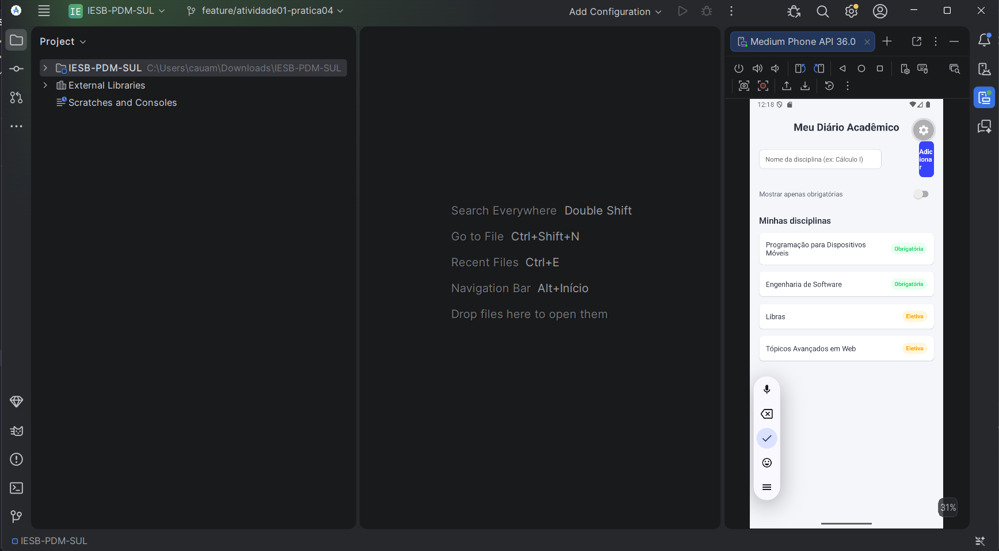
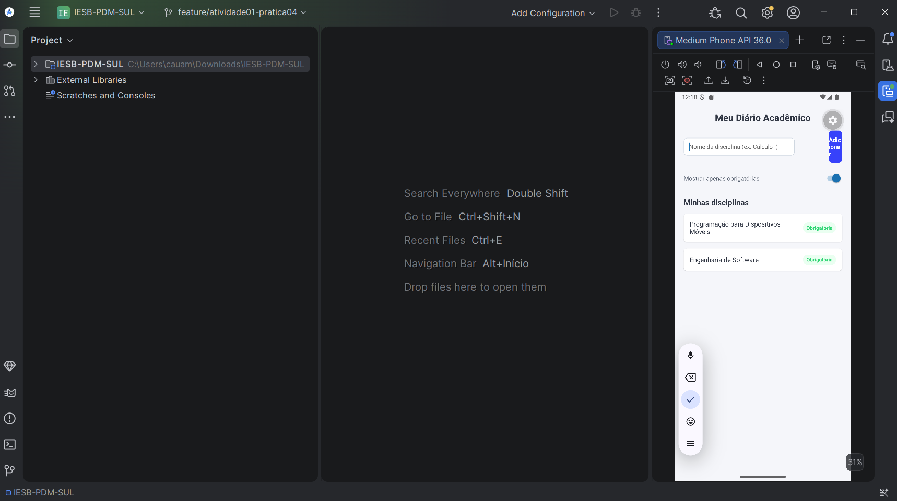

# 📓 MeuDiarioAcademico

**Atividade 01 — Fundamentos de UI, Componentes e Layout**
Disciplina: Programação para Dispositivos Móveis (React Native / Expo)
Professor: Marcelo Alves Farias — IESB
Aulas relacionadas: 01, 02, 03 e 04

##  Objetivo

Tela inicial de cadastro rápido de disciplinas do semestre, consolidando a
criação de projeto Expo, Core Components, import/export, `StyleSheet` e
Flexbox.

##  Comando usado para criar o projeto

```bash
npx create-expo-app@latest MeuDiarioAcademico --template blank
```

Dependência nativa adicionada com `expo install` (conforme recomendado, em
vez de `npm install` direto):

```bash
npx expo install react-native-safe-area-context
```

##  Como rodar

```bash
cd MeuDiarioAcademico
npm install
npx expo start
```

Escaneie o QR Code com o app **Expo Go** (Android) ou rode em um emulador
Android (`a` no terminal do Metro).

##  Estrutura

```text
MeuDiarioAcademico/
├── App.js        # Tela principal (layout, componentes e estilos)
├── labels.js     # Rótulos de texto exportados/importados em App.js
├── app.json      # Configuração do projeto Expo
└── assets/       # Ícones e imagens padrão do template
```

##  Requisitos atendidos

- **Organização de código**: `labels.js` exporta as constantes de texto
  (título, placeholder, botão, título da lista, label do switch),
  importadas em [App.js](./App.js).
- **Interface**: `SafeAreaView` (de `react-native-safe-area-context`)
  envolvendo a tela, cabeçalho com o título do app, linha
  (`flexDirection: 'row'`) com `TextInput` (~70% da largura) e botão
  "Adicionar" (~28% via `flex`), e lista estática de disciplinas renderizada
  com `.map()` abaixo do título "Minhas disciplinas".
- **Estilos**: `StyleSheet.create` com `container` (`flex: 1` + `padding`),
  `input` (`borderWidth`, `borderColor`, `borderRadius`), itens de lista com
  `margin`, `padding` e `backgroundColor`. Os principais usos de
  `justifyContent`/`alignItems` estão comentados diretamente no código.
- **Dimensões**: uso de largura percentual (`width: '70%'` no input) e de
  `flex` (no botão, no container e na lista).
- **Desafio opcional**: botão implementado com `Pressable` (com estilo de
  "pressionado") e `Switch` "Mostrar apenas obrigatórias" — já filtra
  visualmente a lista estática ao ser ativado.

##  Prints da tela

| Tela inicial | Switch ativado (filtra obrigatórias) |
| --- | --- |
|  |  |

##  Entrega (fluxo Git sugerido)

```bash
git checkout -b feature/atividade01-pratica04
git add .
git commit -m "Feat: Atividade 01 - tela inicial do MeuDiarioAcademico"
git push origin feature/atividade01-pratica04
```

- **Link do PR**: https://github.com/CauaMata14/IESB-PDM-SUL/pull/2

